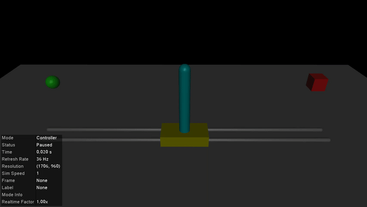

# Balancing a Cart-Pole

For our first example, we'll simulate a cart-pole system balancing its pendulum in the upright equilibrium using a [*Linear Quadratic Regulator* (LQR)](https://en.wikipedia.org/wiki/Linear%E2%80%93quadratic_regulator). Simulating controllers which balance and stabilise robotic systems is a common use-case for MuJoCo, so this is a good starting point. There are plenty of different ways to design stabilising controllers for the cart-pole system (eg: [PID](https://en.wikipedia.org/wiki/Proportional%E2%80%93integral%E2%80%93derivative_controller), [MPC](https://en.wikipedia.org/wiki/Model_predictive_control), [reinforcement learning](https://en.wikipedia.org/wiki/Reinforcement_learning), etc...). Feel free to extend this example with your own controllers and play around with it!


## Loading a model

Our first step is to load a MuJoCo model of the cart-pole system. You can find a copy of the standard `cartpole.xml` file used by DeepMind [here](https://github.com/JamieMair/MuJoCo.jl/blob/42ec7971be584e3f87aacae40e50f8d43a2dc29c/docs/src/examples/cartpole.xml). 

```@example cartpole
using MuJoCo

model = load_model("cartpole.xml")
data = init_data(model)

println("Initial position: ", data.qpos)
println("Initial velocity: ", data.qvel)
```

The system starts off with zero velocity, at the origin (`data.qpos[1] == 0`) and with the pendulum perfectly upright (`data.qpos[1] == 0`). This is the state we'll want to keep it in with our controller.

## A quick review of LQR

There are many textbooks, tutorials, and course notes describing LQRs in considerable depth (see [here](http://underactuated.mit.edu/lqr.html#section3) for an example). We'll give a brief, high-level recap here. Suppose you have a system with state vector $x$ (eg: joint positions and velocities) and some control inputs $u$ (eg: forces and/or torques). We often write the system dynamics as $x_{t+1} = f(x_t, u_t)$, where the function $f$ describes how the states $x$ evolve at each time-step $t$.

In linear control design, our job is often to figure out what the control inputs $u_t$ should be to keep the system at some desired set-point $(x^*, u^*)$. For our cart-pole, we want it to be stationary and upright at the origin, so $(x^*, u^*) = ($`zeros(4)`$, 0)$. Let's look at a linear approximation of the system about this set-point:
```math
\delta x_{t+1} = A \delta x_t + B \delta u_t
```
Here, we've defined $\delta x_t = x_t - x^*$ and $\delta u_t = u_t - u^*$ as the differences between the current and desired states and controls (respectively). The matrices $A,B$ defining the linear model are the Jacobians
```math
A = \frac{\partial f}{\partial x} \quad B = \frac{\partial f}{\partial u}.
```
Our task is to design a controller that will keep $\delta x_t$ and $\delta u_t$ small. In particular, we can define a cost-function that we want our controller to optimise. For an LQR, we define a quadratic cost
```math
J(\delta x_t, \delta u_t) = \delta x_t^\top Q \delta x_t + \delta u_t^\top R \delta u_t
```
to be minimised, where $Q,R$ are positive-definite matrices of our choosing. With a little bit of matrix algebra and vector calculus based on the [Bellman equation](https://en.wikipedia.org/wiki/Bellman_equation), it turns out that the optimal control law is $u_t = -K x_t$ where 
```math
K = (R + B^\top P B)^{-1} B^\top P A\\
P = A^\top P A + Q - A^\top P B (R + B^\top P B)^{-1} B^\top P A.
```
Thankfully, this last equation is a well-studied [Riccati equation](https://en.wikipedia.org/wiki/Riccati_equation), so we can use packages like [`MatrixEquations.jl`](https://github.com/andreasvarga/MatrixEquations.jl) or [`ControlSystems.jl`](https://github.com/JuliaControl/ControlSystems.jl) to solve it for us.

## Linearising the dynamics

We can use the underlying C API for MuJoCo to easily linearise the dynamics for our cart-pole system. The function [`mjd_transitionFD`](https://mujoco.readthedocs.io/en/stable/APIreference/APIfunctions.html#mjd-transitionfd) numerically computes the $A$ and $B$ matrices with a finite difference method through the MuJoCo simulator.
```@example cartpole
# Number of states and controlled inputs
nx = 2*model.nv
nu = model.nu

# Finite-difference parameters
ϵ = 1e-6
centred = true

# Compute the Jacobians
A = mj_zeros(nx, nx)
B = mj_zeros(nx, nu)
mjd_transitionFD(model, data, ϵ, centred, A, B, nothing, nothing)
@show A, B
nothing #hide
```
Note the use of [`mj_zeros`](@ref) to initialise $A,B$. See [Row vs. Column-Major Arrays](@ref) for more details.

## Designing a controller

Now that we have our linear model, all we need to do is compute our LQR gain matrix $K$ based on some cost-function with weights $Q,R$. The state vector for our cart-pole system is `x = [cart_position, pole_angle, cart_velocity, pole_velocity]`. We'll choose $Q,R$ to heavily penalise any movement of the pole away from vertical. This may mean the cart slides around a little bit, but if our goal is to keep the pole upright this is fine.
```@example cartpole
using LinearAlgebra

Q = diagm([1, 10, 1, 5]) # Weights for the state vector
R = diagm([1])           # Weights for the controls
nothing # hide
```
To compute $K$, we could directly use the [`lqr`](https://juliacontrol.github.io/ControlSystems.jl/stable/lib/synthesis/#ControlSystemsBase.lqr-Tuple{Union{Continuous,%20Type{Continuous}},%20Any,%20Any,%20Any,%20Any,%20Vararg{Any}}) function provided in `ControlSystemsBase.jl` with `K = lqr(A,B,Q,R)`. For those who don't want to load the rather large control systems package, we can directly use [`ared`](https://andreasvarga.github.io/MatrixEquations.jl/dev/riccati.html#MatrixEquations.ared) from `MatrixEquations.jl`, which is what `lqr` calls under the hood.
```@example cartpole
using MatrixEquations

S = zeros(nx, nu)
_, _, K, _ = ared(A,B,R,Q,S)
@show K
```

## Simulate and visualise

After all that, we now have a stabilising controller for our cart-pole system! Let's test it out with the visualiser. First, we'll need a `controller` function that takes in the MuJoCo `model` and `data` structs and sets the control variables.
```@example cartpole
function lqr_balance!(m::Model, d::Data)
    state = vcat(d.qpos, d.qvel)
    d.ctrl .= -K * state
    nothing
end
nothing # hide
```
!!! warning "Performance Tip"
    This function captures non-const global variables and will take a performance hit (see [Performance Tips](https://docs.julialang.org/en/v1/manual/performance-tips/#Avoid-untyped-global-variables)) for more details. To remedy the performance hit, one can use functors instead, as described at the end of the [Humanoid LQR](@ref) example.


Now we can visualise the model and see how it goes.
```julia
init_visualiser()
visualise!(model, data; controller=lqr_balance!)
```


When we apply small forces to the pole or the cart, the controller immediately responds to the perturbation and returns the system to its equilibrium position. If the force is big enough, the system will become unstable and the pole will fall down. Feel free to play around with the weights in $Q,R$ to see their effect on the system too!