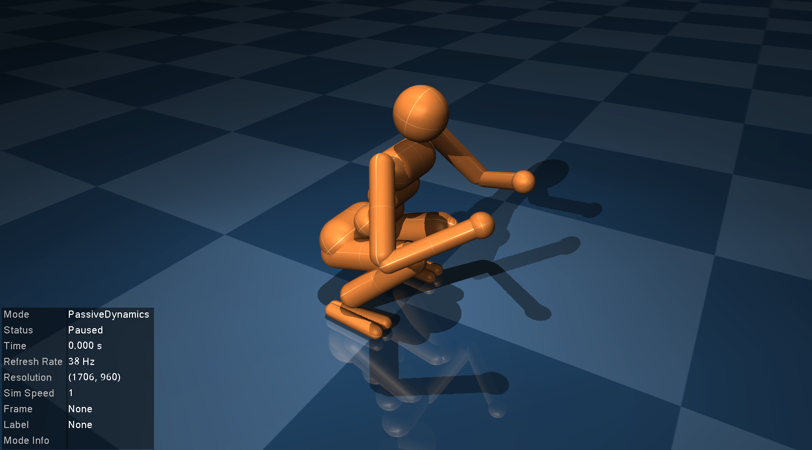
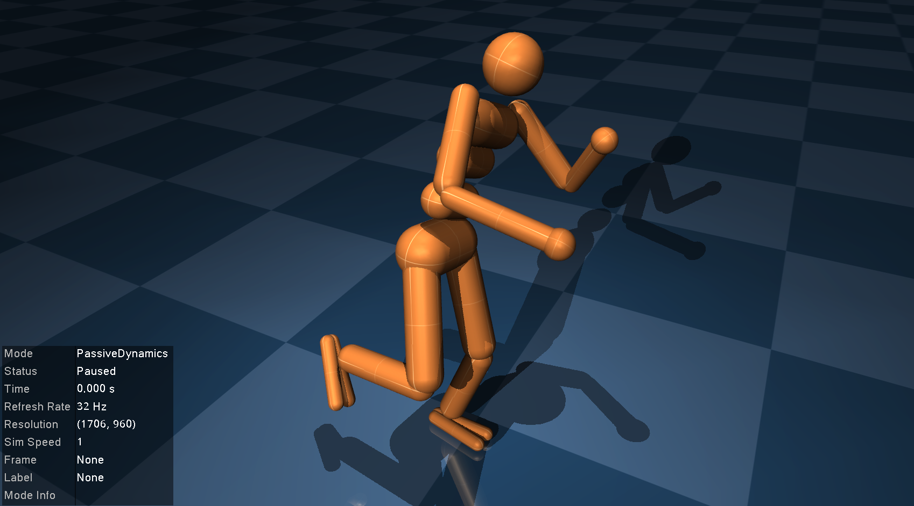
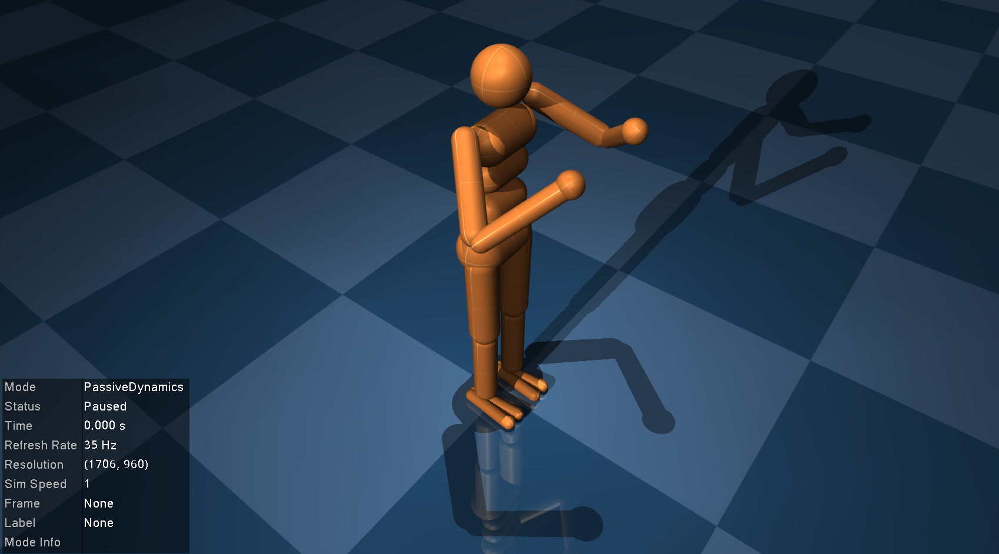

# Humanoid LQR

Our second example closely follows [DeepMind's LQR tutorial](https://colab.research.google.com/github/deepmind/mujoco/blob/main/python/LQR.ipynb) to balance a humanoid on one leg with a [*Linear Quadratic Regulator* (LQR)](https://en.wikipedia.org/wiki/Linear%E2%80%93quadratic_regulator). Users familiar with MuJoCo's [python bindings](https://mujoco.readthedocs.io/en/latest/python.html) might find it useful to compare this tutorial to the DeepMind version to see the similarities and differences with `MuJoCo.jl`.

## The humanoid model

Let's start by having a look at the humanoid model shipped with MuJoCo. You can find a copy of the `humanoid.xml` file [here](https://github.com/google-deepmind/mujoco/blob/main/model/humanoid/humanoid.xml), or locally in the directory given by running [`example_model_files_directory`](@ref).
```@example humanoid
using MuJoCo

model = load_model(joinpath(example_model_files_directory(), "humanoid.xml"))
data = init_data(model)
```
The model comes shipped with three different "keyframes" defining particular starting poses of the humanoid. You can inspect each one by re-setting the model to a specific keyframe with [`resetkey!`](@ref) and running [`visualise!`](@ref).
```julia
init_visualiser()

for i in 1:3
    resetkey!(model, data, i)
    visualise!(model, data)
end
```
```@example
@html_str """<p float="left">    </p>""" # hide
```
None of these initial states are stable. In this example, we'll focus on designing a controller for the second keyframe to get the humanoid to stand and balance on one leg.