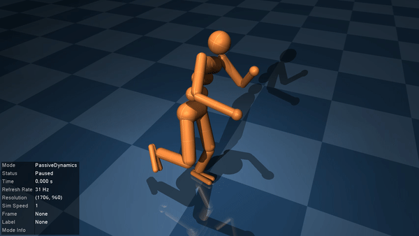

# Humanoid LQR

Our second example is a translation of [DeepMind's LQR tutorial](https://colab.research.google.com/github/deepmind/mujoco/blob/main/python/LQR.ipynb) into Julia. The aim is to balance a humanoid on one leg with a [*Linear Quadratic Regulator* (LQR)](https://en.wikipedia.org/wiki/Linear%E2%80%93quadratic_regulator). Users familiar with MuJoCo's [python bindings](https://mujoco.readthedocs.io/en/latest/python.html) might find it useful to compare this example to the DeepMind tutorial to see the similarities and differences with `MuJoCo.jl`.


## The humanoid model

Let's start by having a look at the humanoid model shipped with MuJoCo. You can find a copy of the `humanoid.xml` file [here](https://github.com/google-deepmind/mujoco/blob/main/model/humanoid/humanoid.xml), or locally in the directory given by running [`example_model_files_directory`](@ref).
```@example humanoid
using MuJoCo

model = load_model(joinpath(example_model_files_directory(), "humanoid", "humanoid.xml"))
data = init_data(model)
nothing # hide
```
The model comes shipped with three different "keyframes" defining particular starting poses of the humanoid. You can inspect each one by re-setting the model to a specific keyframe with [`resetkey!`](@ref) and running [`visualise!`](@ref).
```julia
init_visualiser()

for i in 1:3
    resetkey!(model, data, i)
    visualise!(model, data)
end
```
```@example
@html_str """<p float="left">    </p>""" # hide
```
None of these initial states are stable. In this example, we'll focus on designing a controller for the second keyframe to get the humanoid to stand and balance on one leg. 


## Computing the control set-point

To design our linear controller, we'll need a set-point $(x^*, u^*)$ about which to stabilise the system. We already have $x^*$, since the desired state is just the starting position of the humanoid in keyframe 2. To find the control inputs required to hold the humanoid in this position, we'll use inverse dynamics via MuJoCo's [`mj_inverse`](@ref). If we set all joint accelerations to zero, [`mj_inverse`](@ref) computes the forces required to hold the model in a given configuration. Let's try it out.
```@example humanoid
# Reset to desired keyframe
keyframe = 2
resetkey!(model, data, keyframe)

# Propagate derived quantities
mj_forward(model, data)
# Set joint accelerations to 0
data.qacc .= 0

# Inspect forces from inverse dynamics
mj_inverse(model, data)
println("Required control: ", data.qfrc_inverse)
```
Unfortunately for us, things are not so simple. `data.qfrc_inverse` stores the calculated forces that are required to achieve the desired joint acceleration. Looking at its output, we see that the third element is a large value. This corresponds to an unphysical vertical force due to the humanoid starting slightly above the ground. The simulator has been forced to introduce this impossible force to meet the requirement that `data.qacc == 0`.

We can remove this unphysical force by slightly tweaking the starting height of the model. Let's examine how this large force changes when we move the humanoid up/down from its starting position. We will examine the range of heights from $\pm 1$mm. Note that all heights are all measured in metres.
```@example humanoid
using CairoMakie
using LinearAlgebra

heights = LinRange(-0.001, 0.001, 2001) # -1mm to +1mm
# Map each height to the corresponding high force output
u_vert = map(heights) do h
    # Set model in position with qacc == 0
    resetkey!(model, data, keyframe)
    mj_forward(model, data)
    data.qacc .= 0

    # Offset the height and check required vertical forces
    data.qpos[3] += h
    mj_inverse(model, data)
    return data.qfrc_inverse[3] # 3 -> z-force
end

# Find height corresponding to minimum fictitious force (best offset)
height = heights[argmin(abs.(u_vert))]
height_mm = height*1000
heights_mm = heights .* 1000

# Compare force to weight of humanoid
weight = sum(model.body_mass) * norm(model.opt.gravity)

fig = Figure(resolution=(500,300))
ax = Axis(fig[1,1], xlabel="Vertical offset (mm)", ylabel="Vertical force (N)")
lines!(ax, heights_mm, u_vert, label="Vertical force")
lines!(ax, heights_mm, weight*ones(length(heights)), linestyle=:dash, label="Weight")
lines!(ax, [height_mm, height_mm], [minimum(u_vert), maximum(u_vert)], linestyle=:dash)
axislegend(ax,position=:rb)
save("humanoid_force_offset.svg",fig) # hide
nothing #hide
```


As we lift the humanoid upwards, the vertical force increases until it exactly balances the weight of the humanoid. This is the force required to keep the accelerations zero while the model is in the air. Pushing the humanoid down, however, requires an increasingly negative vertical force to explain the fact that its foot is penetrating the floor but `data.qacc == 0`. At a height of approximately $-0.5\,$mm the humanoid's foot is just resting on the floor and all forces can be accounted for by internal torques only. This is the case we're interested in.

Let's now take our best-choice offset and save the humanoid's position and forces (from inverse dynamics) to define our set point. Our position set-point is just `data.qpos` after changing the height.
```@example humanoid
resetkey!(model, data, keyframe)
mj_forward(model, data)
data.qacc .= 0
data.qpos[3] += height
qpos0 = copy(data.qpos)
println(qpos0)
```
We can compute the control set-point by propagating the required forces through the actuator dynamics. For the simple linear motors in our humanoid robot, we can directly use `data.actuator_moment` as the Jacobian of `data.qfrc_inverse` with respect to `data.ctrl`.
```@example humanoid
mj_inverse(model, data)
qfrc0 = copy(data.qfrc_inverse)

M_act = data.actuator_moment
ctrl0 = pinv(M_act)' * qfrc0
println(ctrl0)
```
As a sanity check, let's verify that these control inputs actually give us the right forces.
```@example humanoid
data.ctrl .= ctrl0
mj_forward(model, data)
qfrc_test = data.qfrc_actuator
println("Desired forces: ", qfrc0)
println("Actual forces:  ", qfrc_test)
println("Joint forces equal? ", all((qfrc_test .≈ qfrc0)[7:end]))
```
The actuator forces are approximately equal to the desired forces `qfrc0` for all joints in the humanoid. The first six elements correspond to forces on the "root joint" (the free body of the humanoid). There is still a slight mismatch here, but it is minor.
Let's also have a look at how the model behaves if we start it exactly at our set point.
```julia
reset!(model, data)
data.qpos .= qpos0
data.ctrl .= ctrl0
visualise!(model, data)
```


The humanoid still falls over because we are trying to stabilise the system at an unstable equilibrium point, and the control set-point `ctrl0` is only an approximation. Even if we had found the exact controls to hold the system in `qpos0`, any slight perturbation would cause the humanoid to fall over. We therefore need a controller.


## Designing the LQR cost

*See [A quick review of LQR](@ref) if you're in need of a refresher on linear quadratic regulators.*

Now that we have our set point to stabilise, we'll need to design the LQR weight matrices $Q,R$ to encourage the system to remain balanced. Let's start by setting `R` equal to the identity matrix `I` and defining some useful variables.
```@example humanoid
nu = model.nu # number of actuators/controls
nv = model.nv # number of degrees of freedom
R = Matrix{Float64}(I, nu, nu)
nothing #hide
```
We'll construct the $Q$ matrix in two parts: one component to encourage the humanoid's centre of mass (CoM) to remain above its foot (helps with stability), and another component to keep the joints close to their original configuration `qpos0`.

### CoM balancing cost

Much like the Python bindings, `MuJoCo.jl` includes a number of useful functions to isolate and work with different parts of a MuJoCo model. Let's extract references for the torso and left foot and have a look at one of them.
```@example humanoid
import MuJoCo as MJ

torso = MJ.body(model, "torso")
left_foot = MJ.body(model, "foot_left")
```
One way to keep the CoM over the left foot is to design $Q$ from the difference between the CoM and left-foot Jacobians. MuJoCo's C API comes with a number of very useful functions for computing Jacobians.
```@example humanoid
# Get Jacobian for torso CoM
reset!(model, data)
data.qpos .= qpos0
forward!(model, data)
jac_com = mj_zeros(3, nv)
mj_jacSubtreeCom(model, data, jac_com, torso.id)

# Get (left) foot Jacobian for balancing
jac_foot = mj_zeros(3, nv)
mj_jacBodyCom(model, data, jac_foot, nothing, left_foot.id)

# Design Q-matrix to balance CoM over foot
jac_diff = jac_com .- jac_foot
Qbalance = jac_diff' * jac_diff
println(Qbalance) #hide
```
Note the use of `mj_zeros` to initialise the Jacobians, as outlined in [Row vs. Column-Major Arrays](@ref).

### Joint deviation cost

We will also want to add a cost on the joints deviating from the desired position `qpos0`. However, different parts of the humanoid will need to be treated differently. In particular:
- The "free joints" (i.e: CoM position) should have no cost on them here, since we've already defined `Qbalance` to take care of them.
- The joints in the left leg and lower abdomen should be held close to their original values to keep the balancing leg in place
- Other joints, such as flailing limbs, should be allowed to move around more freely to maintain balance if the humanoid is perturbed.

Let's start by finding the array indices relevant to each set of joints. We'll leverage some of the nice features of the [Named Access](@ref) tools.
```@example humanoid
# Get indices into relevant sets of joints.
free_dofs = 1:6
body_dofs = 7:nv

# Get all the joints using a list comprehension. 
# We add one to the raw ID to get the Julia 1-based index of the joint.
abdomen_dofs = [jnt.id+1 for jnt in MJ.joints(model) if occursin("abdomen", jnt.name)]
left_leg_dofs = [jnt.id+1 for jnt in MJ.joints(model) if occursin("left", jnt.name) && any(occursin(part, jnt.name) for part in ("hip", "knee", "ankle"))]

balance_dofs = vcat(abdomen_dofs, left_leg_dofs)
other_dofs = setdiff(body_dofs, balance_dofs)

println("Balance dofs: ", balance_dofs)
println("Other dofs:   ", other_dofs)
```
We can now use these indices to construct the second part of the $Q$ matrix.
```@example humanoid
# Cost coefficients
balance_joint_cost = 3          # Joints can move a bit and still balance
other_joint_cost   = 0.3        # Other joints can do whatever

# Construct joint Q matrix
Qjoint = Matrix{Float64}(I, nv, nv)
Qjoint[free_dofs, free_dofs] *= 0
Qjoint[balance_dofs, balance_dofs] *= balance_joint_cost
Qjoint[other_dofs, other_dofs] *= other_joint_cost
nothing #hide
```

Putting this all together with `Qbalance`, we can construct our final $Q$ matrix defining our LQR cost.
```@example humanoid
balance_cost = 1000

Qpos = balance_cost*Qbalance + Qjoint
Q = [Qpos zeros(nv,nv); zeros(nv, 2nv)]  + (1e-10) * I # Add ϵI for positive definite Q
println(Q) # hide
```
Note that the `balance_cost` is quite large in comparison to `balance_joint_cost` because the units for the CoM position (metres) are typically "larger" than the units for joint angles (radians). Eg: if the CoM shifts by $0.1\,$m, the humanoid will most likely fall over, but a $0.1\,$radian change in a leg angle will probably be fine.

## Computing optimal control gains

With both cost matrices defined, computing the optimal control gains is simply a matter of linearising the system dynamics about our chosen set-point `(qpos0, ctrl0)` and solving the LQR Riccati equations. We can follow the same process as our [Balancing a Cart-Pole](@ref) example. Let's start with the linear system Jacobians.
```@example humanoid
# Initialise the model at our set point
reset!(model, data)
data.ctrl .= ctrl0
data.qpos .= qpos0

# Finite-difference parameters
ϵ = 1e-6
centred = true

# Compute the Jacobians
A = mj_zeros(2nv, 2nv)
B = mj_zeros(2nv, nu)
mjd_transitionFD(model, data, ϵ, centred, A, B, nothing, nothing)
@show A, B
```
Just like the cart-pole example, we'll directly use [`ared`](https://andreasvarga.github.io/MatrixEquations.jl/dev/riccati.html#MatrixEquations.ared) from `MatrixEquations.jl` to compute the LQR gain matrix $K$ as a lightweight alternative to loading `ControlSystemsCore.jl`.
```@example humanoid
using MatrixEquations

S = zeros(2nv, nu)
_, _, K, _ = ared(A,B,R,Q,S)
```

## Testing the controller

We are now ready to test our controller. First, we'll write a function to set the control gains on our humanoid at each simulation time-step. Note the use of [`mj_differentiatePos`](@ref) to compute the position error, which uses a finite difference to calculate the difference between two positions rather than subtracting `qpos0 - data.qpos`. This is necessary because orientations of free bodies in MuJoCo are represented by 4-element quaternions, but we are interested in differences between points in 3D space. This is why `model.nq >= model.nv` for all MuJoCo models.
```@example humanoid
function humanoid_ctrl!(m::Model, d::Data)
    Δq = zeros(m.nv)
    mj_differentiatePos(m, Δq, 1, qpos0, d.qpos)

    Δx = vcat(Δq, data.qvel)
    data.ctrl .= ctrl0 .- K*Δx
    nothing
end
nothing # hide
```
!!! warning "Performance Tip"
    This function captures non-const global variables and will take a performance hit (see [Performance Tips](https://docs.julialang.org/en/v1/manual/performance-tips/#Avoid-untyped-global-variables)) for more details. To remedy the performance hit, one can use functors instead, as described [below](#improve-performance-with-functors-and-cached-memory).

Let's run the visualiser and test our controller by manually perturbing the humanoid. You can do this by double-clicking on a body to select it, then `CTRL+RightClick` and drag to apply a force.
```julia
reset!(model, data)
data.qpos .= qpos0
visualise!(model, data, controller=humanoid_ctrl!)
```


For small perturbations, our controller works just great! If you apply a large perturbation, you'll find that it's easy to de-stabilise the system and get the humanoid to fall over. This is to be expected from a simple LQR, but feel free to play around with the weight matrices to see if you can improve the robustness. In general, designing robust controllers for nonlinear systems is a difficult challenge and an open area of research in the control community.

## Improve performance with functors and cached memory

A functor in Julia can be created by defining a struct to hold any variables that may be needed by a function, and defining the function itself when the struct is called. The struct will store all the variables that are used within the function that are not accessible from the input arguments. Our humanoid controller requires `qpos0`, `ctrl0` and `K`. We also can reuse some memory in the form of `Δq` and `Δx`, so we can store this too inside the functor. Finally, we can store a matrix which holds the output of the `K*Δx` matrix multiplication.

```@example humanoid
struct LQRHumanoidBalance{TQ,TC,TK,TDQ,TDX,TKDX}
    qpos0::TQ
    ctrl0::TC
    K::TK
    Δq::TDQ
    Δx::TDX
    KΔx::TKDX
end
nothing # hide
```
Notice that we are not restricting the types of the fields for clarity, however, the true type will be stored in the functors type information.

Next, we must define the actual function body for the functor, which follows the same format as the previous controller:
```@example humanoid
function (functor::LQRHumanoidBalance)(model::Model, data::Data)
    Δq = functor.Δq
    mj_differentiatePos(model, Δq, 1, functor.qpos0, data.qpos)

    Δx = functor.Δx
    Δx[1:length(Δq)] .= Δq
    Δx[(length(Δq)+1):end] .= data.qvel

    KΔx = functor.KΔx
    mul!(KΔx, functor.K, Δx)

    data.ctrl .= functor.ctrl0 .- KΔx
    nothing
end
nothing # hide
```
We can now create an instance of the functor, creating memory for the caches as well:
```@example humanoid
controller = LQRHumanoidBalance(
    qpos0,
    ctrl0,
    K,
    zeros(eltype(qpos0), model.nv), # Δq
    zeros(eltype(qpos0), 2 * model.nv), # Δx
    similar(ctrl0) # KΔx
);
nothing # hide
```
Now we can benchmark these two functions with `BenchmarkTools.jl`:
```@example humanoid
using BenchmarkTools
@benchmark humanoid_ctrl!(model, data)
```
```@example humanoid
@benchmark controller(model, data)
```
We can see that using a functor will give the best performance, at the cost of slightly more boilerplate code. 
!!! warning "Thread Safety"
    The use of the functor with local cache is not thread-safe, and a different functor must be used on each thread if running in parallel.