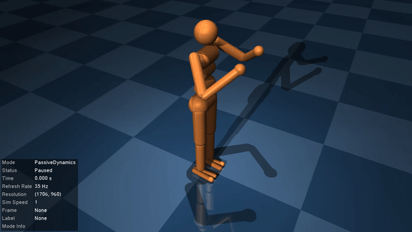

# Humanoid LQR

Our second example closely follows [DeepMind's LQR tutorial](https://colab.research.google.com/github/deepmind/mujoco/blob/main/python/LQR.ipynb) to balance a humanoid on one leg with a [*Linear Quadratic Regulator* (LQR)](https://en.wikipedia.org/wiki/Linear%E2%80%93quadratic_regulator). Users familiar with MuJoCo's [python bindings](https://mujoco.readthedocs.io/en/latest/python.html) might find it useful to compare this tutorial to the DeepMind version to see the similarities and differences with `MuJoCo.jl`.

## The humanoid model

Let's start by having a look at the humanoid model shipped with MuJoCo. You can find a copy of the `humanoid.xml` file [here](https://github.com/google-deepmind/mujoco/blob/main/model/humanoid/humanoid.xml), or locally in the directory given by running [`example_model_files_directory`](@ref).
```@example humanoid
using MuJoCo

model = load_model(joinpath(example_model_files_directory(), "humanoid.xml"))
data = init_data(model)
```
The model comes shipped with three different "keyframes" defining particular starting poses of the humanoid. You can inspect each one by re-setting the model to a specific keyframe with [`resetkey!`](@ref) and running [`visualise!`](@ref).
```julia
init_visualiser()

for i in 1:3
    resetkey!(model, data, i)
    visualise!(model, data)
end
```
```@example
@html_str """<p float="left">    </p>""" # hide
```
None of these initial states are stable. In this example, we'll focus on designing a controller for the second keyframe to get the humanoid to stand and balance on one leg. 

## Computing the control set-point

To design our linear controller, we'll need a set-point $(x^*, u^*)$ about which to stabilise the system. We already have $x^*$, since the desired state is just the starting position of the humanoid in keyframe 2. To find the control inputs required to hold the humanoid in this position, we'll use inverse dynamics via MuJoCo's [`mj_inverse`](@ref). If we set all joint accelerations to zero, [`mj_inverse`](@ref) computes the forces required to hold the model in a given configuration. Let's try it out.
```@example humanoid
# Reset to desired keyframe
keyframe = 2
resetkey!(model, data, keyframe)

# Propagate derived quantities and set joint accelerations to 0
mj_forward(model, data)
data.qacc .= 0

# Inspect forces from inverse dynamics
mj_inverse(model, data)
println("Required control: ", data.qfrc_inverse)
```
Unfortunately for us, things are not so simple. Looking at the output of `data.qfrc_inverse`, we see that the third element is a large value. This corresponds to an unphysical vertical force due to the humanoid starting slightly above the ground. The simulator has therefore created a fictious force to meet the requirement that `data.qacc == 0`.

We can rid ourselves of this extra force by slightly tweaking the starting height of the model. Let's move the humanoid up/down from its starting position by $\pm 1\,$mm and plot the vertical force as a function of height.
```@example humanoid
using CairoMakie
using LinearAlgebra

heights = LinRange(-0.001, 0.001, 2001)
u_vert = zeros(length(heights))

for k in eachindex(heights)

    # Set model in position with qacc == 0
    resetkey!(model, data, keyframe)
    mj_forward(model, data)
    data.qacc .= 0

    # Offset the height and check required vertical forces
    data.qpos[3] += heights[k]
    mj_inverse(model, data)
    u_vert[k] = data.qfrc_inverse[3] # 3 -> z-force
end

# Find height corresponding to minimum ficticous force (best offset)
height = heights[argmin(abs.(u_vert))]
height_mm = height*1000
heights_mm = heights*1000

# Compare force to weight of humanoid
weight = sum(model.body_mass) * norm(model.opt.gravity)

fig = Figure(resolution=(500,300))
ax = Axis(fig[1,1], xlabel="Vertical offset (mm)", ylabel="Vertical force (N)")
lines!(ax, heights_mm, u_vert, label="Vertical force")
lines!(ax, heights_mm, weight*ones(length(heights)), linestyle=:dash, label="Weight")
lines!(ax, [height_mm, height_mm], [minimum(u_vert), maximum(u_vert)], linestyle=:dash)
axislegend(ax,position=:rb)
save("humanoid_force_offset.svg",fig)
nothing #hide
```


As we lift the humanoid upwards, the vertical force increases until it exactly balances the weight of the humanoid. This is the force required to keep the accelerations zero while the model is in the air. Pushing the humanoid down, however, requires an increasingly negative vertical force to explain the fact that its foot is penetrating the floor but `data.qacc == 0`. At a height of approximately $-0.5\,$mm the humanoid's foot is just resting on the floor and all forces can be accounted for by internal torques only. This is the case we're interested in.

Let's now take our best-choice offset and save the humanoid's position and forces (from inverse dynamics) to define our set point. Our position set-point is just `data.qpos` after changing the height.
```@example humanoid
resetkey!(model, data, keyframe)
mj_forward(model, data)
data.qacc .= 0
data.qpos[3] += height
qpos0 = copy(data.qpos)
println(qpos0)
```
We can compute the control set-point by propagating the required forces through the actuator dynamics. For the simple linear motors in our humanoid robot, we can directly use `data.actuator_moment` as the Jacobian of `data.qfrc_inverse` with respect to `data.ctrl`.
```@example humanoid
mj_inverse(model, data)
qfrc0 = copy(data.qfrc_inverse)

M_act = data.actuator_moment
ctrl0 = pinv(M_act)' * qfrc0
println(ctrl0)
```
As a sanity check, let's verify that these control inputs actually give us the right forces.
```@example humanoid
data.ctrl .= ctrl0
mj_forward(model, data)
qfrc_test = data.qfrc_actuator
println("Desired force match actual forces: ", all((qfrc_test .≈ qfrc0)[7:end]))
```
Let's also have a look at how the model behaves if we start it at exactly our control set-point.
```julia
reset!(model, data)
data.qpos .= qpos0
data.ctrl .= ctrl0
visualise!(model, data)
```


The humanoid still falls over because we are trying to stabilise the system at an unstable equilibrium point, and the control set-point `ctrl0` is only an approximation. Even if we had found the exact controls to hold the system in `qpos0`, any slight perturbation would cause the humanoid to fall over. We therefore need a controller.

## Designing the LQR cost

*See [A quick review of LQR](@ref) if you're in need of a refresher on linear quadratic regulators.*


## Computing optimal control gains


## Testing the controller