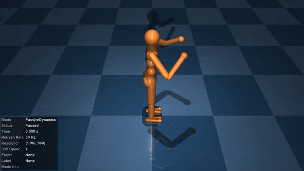

# Getting Started

## Installation

To install `MuJoCo.jl`, simply run the following code in a Julia REPL:
```julia
import Pkg
Pkg.add("MuJoCo.jl")
```
This will download and install the package, along with the underlying C library. We highly recommend activating a project to manage dependencies - see the [docs](https://docs.julialang.org/en/v1/stdlib/Pkg/) for more information.

Once installed, you can load the package in the REPL just like any other Julia package. To use the visualiser and see your MuJoCo models in action, you will need to install some additional dependencies with
```julia
using MuJoCo
install_visualiser()
```

## Basic Usage

You should now be able to load in and play around with any MuJoCo model of your choosing. You can create your own MuJoCo models with the [MJCF modelling language](https://mujoco.readthedocs.io/en/stable/XMLreference.html), but for now we'll load in a model of a humanoid for demonstration purposes.
```@example demo
using MuJoCo

model, data = MuJoCo.sample_model_and_data()
@show typeof(model), typeof(data)
```
The `Model` and `Data` types encode all the information required to simulate a model in MuJoCo, and are wrappers of the `mjModel` and `mjData` structs in the C API, respectively. We can directly access any data from these structs:
```@example demo
println("Simulation timestep: ", model.opt.timestep)
println("Positions of joints: ", data.qpos)
```
We can also directly read and write from/to these fields. However, we cannot directly overwrite any arrays. Instead, we can use Julia's broadcasting to set values as we see fit. Let's write a function that inputs random control torques to the humanoid's joints.
```@example demo
function random_controller!(m::Model, d::Data)
    nu = m.nu
    d.ctrl .= 2*rand(nu) .- 1
    return nothing
end
```
We can now simulate motion of the humanoid under this control scheme. Let's simulate over 100 time-steps.
```@example demo
for t in 1:100
    random_controller!(model, data)
    step!(model, data)
end
```
At each time-step, `random_controller!` sets the control signal to some random value, and `step!` calls the MuJoCo physics engine to simulate the response of the system. `step!` directly modifies the `data` struct. For example, looking at `data.qpos` again shows that the joints have all moved.
```@example demo
println("New joint positions: ", data.qpos)
```
After finishing our initial simulations, we can re-set the model back to its starting position by calling `mj_resetData`, one of the underlying C library functions. Any of the functions listed in the [LibMuJoCo Index](@ref) can be used just as they are described in the [MuJoCo documentation](https://mujoco.readthedocs.io/en/stable/APIreference/index.html).
```@example demo
mj_resetData(model, data)
println("Reset joint positions: ", data.qpos)
```

## Visualising a Model

Of course, the best way to understand what a MuJoCo model is doing is to visualise it. To use the visualiser, simply initialise it and call [`visualise!`](@ref). We can test our controller by passing in our function via the `controller` keyword.
```julia
init_visualiser()
visualise!(model, data, controller=random_controller!)
```


Press `F1` for help after running the visualiser to print the available options in a terminal. Some of the most interesting are:
- Press `CTRL+RightArrow` (or `CMD` for Mac) to cycle between the passive dynamics and the controlled motion
- Press `SPACE` to pause/unpause
- Double-click on an object select it
- `CTRL+RightClick` and drag to apply a force
- Press `Backspace` to reset the model
- Press `ESC` to exit the simulation

## Visualising a Trajectory

Sometimes it will be more convenient to simulate the motion of a MuJoCo model and save its response for later analysis. The visualiser includes a `Trajectory` mode to enable this. Let's [`reset!`](@ref) our humanoid model and set its initial height to 2 metres above the ground.

```@example demo
reset!(model, data)
data.qpos[3] = 2
forward!(model, data) # Propagate the physics forward 
```

The motion of every MuJoCo model can be described by some physical [state vector](https://mujoco.readthedocs.io/en/stable/computation/index.html#physics-state) consisting of the positions and velocities of its components, and the state of its actuators. We have included [`get_physics_state`](@ref) and [`set_physics_state!`](@ref) to allow users to record (and set) the states of a model during simulation. Let's simulate our humanoid for another 100 timesteps and record its state.

```@example demo
tmax = 400
nx = model.nq + model.nv + model.na # State vector dimension
states = zeros(nx, tmax)
for t in 1:tmax
    states[:,t] = get_physics_state(model, data)
    step!(model, data)
end
```

We'll also go back and save the humanoid states under our random controller. 
```@example demo
reset!(model, data)
ctrl_states = zeros(nx, tmax)
for t in 1:tmax
    ctrl_states[:,t] = get_physics_state(model, data)
    random_controller!(model, data)
    step!(model, data)
end
```

We can now play back either the passive or controlled humanoid motion whenever we like using the `Trajectory` mode in the visualiser. This allows us to re-wind the simulation, simulate it backwards, skip forward/backwards a few frames, and add some cool visualisation features.

```julia
visualise!(model, data, trajectories = [states, ctrl_states])
```


You might find the following tips useful:
- Press `CTRL+RightArrow` (or `CMD` for Mac) to cycle between the passive dynamics and the saved trajectories
- Press `F1` to see the new `Trajectory` mode button and mouse options, including:
    - Press `UP` or `DOWN` to cycle between trajectories
    - PRESS `CTRL+R` for reverse mode
    - Press `CTRL+B` to turn burst-mode on
    - Press `CTRL+D` to add a doppler shift

We strongly recommend saving trajectories for later visualisation if you're simulating any particularly complicated tasks in MuJoCo. You can start up the visualiser with all three of the passive dynamics, controlled dynamics, and saved trajectories. See [`visualise!`](@ref) for details.

Happy visualising!
